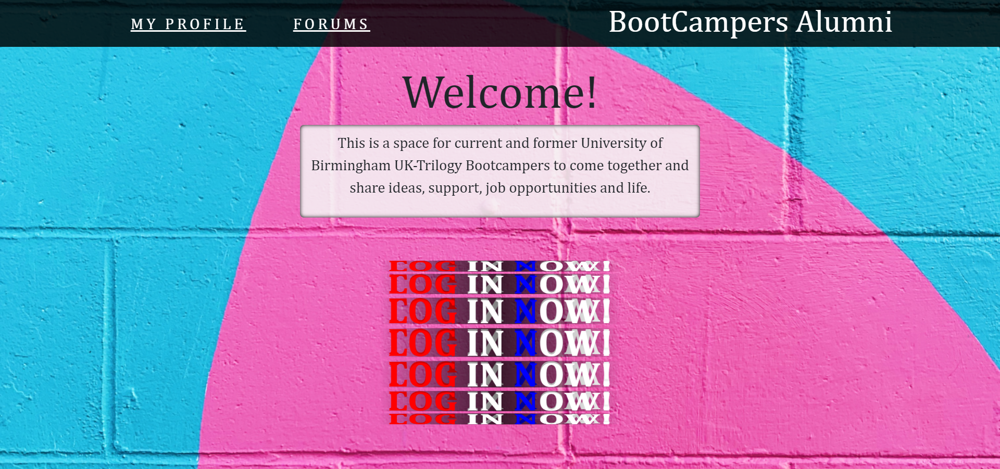
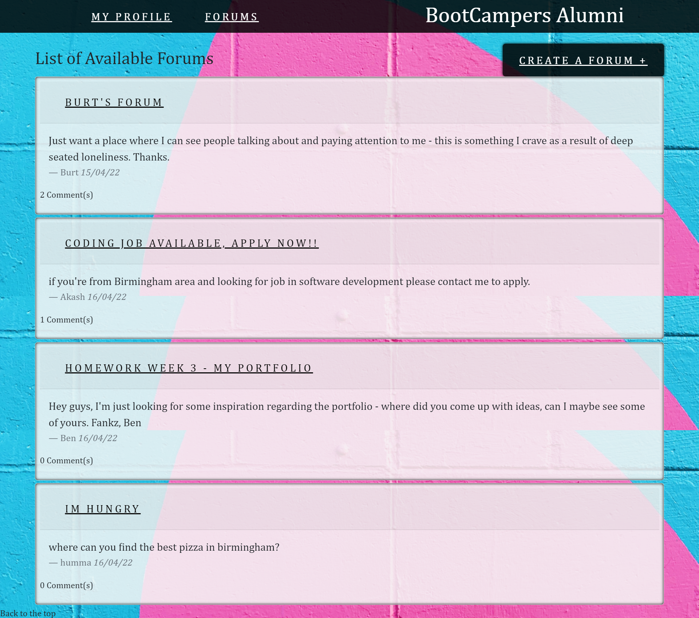
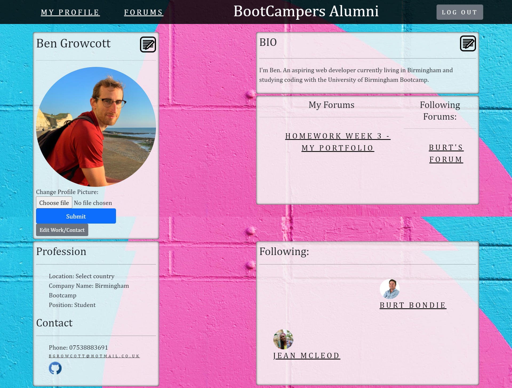

# Bootcampers Alumni
----
## Description

This is a space for current and former coding Bootcampers to come together and share ideas, support, job opportunities and life.

A user can log in, create a profile, browse and create forums and converse with other students and alumni.

## Table of Contents

1. [Usage](#usage)
2. [Technology Stack](#technology-stack)
3. [License](#license)
4. [Contributing](#contributing)
5. [Questions](#questions)

## Usage

- Visiting the website for the first time presents the user with a homepage which prompts the user to log in or sign up.
    - Upon signing up the user is taken to their profile page where they can add their details to the page.
    - A user can view the current forums, create their own and comment on other peoples.
    - You can also follow forums and other users and see the forums and users you are following from your own profile page.
- Account details are protected with bcrypt and logging in is required to view profiles and create and comment on forums.

### Screenshots

### Deployed Application

[Bootcampers Alumni](https://pascal-project.herokuapp.com/)
## Technology Stack

- JavaScript
- CSS
- Handlebars
- ExpressJS
- MySQL
- Sequelize ORM
- bcrypt
- Express Session
- NodeJS
- jQuery
- AWS S3

## License

This project is covered under the MIT License.

## Contributing
---
Ben Growcott - [GitHub](https://github.com/BGrowcott)
 
Akash Limbu - [GitHub](https://github.com/AkashWanem)
 
Jean McLeod - [GitHub](https://github.com/Abrics)
 

## Questions

If you have any questions or suggestions please contact us via GitHub or Email:

Ben Growcott:
[Email](mailto:bg.coding101@gmail.com)

Akash Limbu:
[Email](mailto:akaah.wanem@gmail.com)

Jean McLeod:
[GitHub](https://github.com/Abrics)
